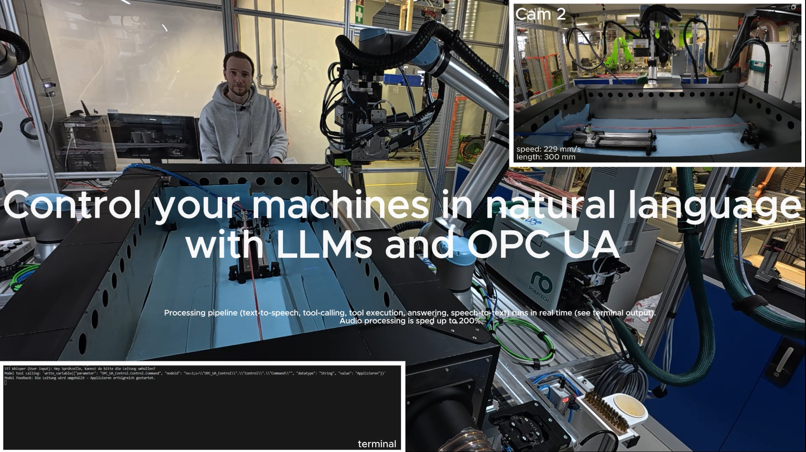

This repository contains supporting material for the paper:

**Beyond touch-based human-machine-interface: Control your machines in natural language by utilizing large language models and OPC UA**

DOI: https://doi.org/10.48550/arXiv.2510.11300

## 🎥 System Demonstration Video

**Contents**
- tools_mcp.py: Contains the three tools (read,write,adjust) and the launch of the mcp-server with gradio
- tool_schema.json: Tool schema necessary to equip the two open-weight models GPT-oss:20b and Qwen3:32b
- load_tool_schema.py: Script to load the schema
- results: Input and output of the five tested models (GPT5, GPT5-mini, GPT5-nano, GPT-oss:20b, Qwen3:32b)
  - logged_restuls_{model}.xlsx
